The Ushahidi Project ([*https://www.ushahidi.com*](https://www.ushahidi.com)) is an open-source crisis mapping web application. There are several software components hosted at [*https://github.com/ushahidi/*](https://github.com/ushahidi/) but two that are relevant are **platform** ([*https://github.com/ushahidi/platform*](https://github.com/ushahidi/platform)) and **platform-client** ([*https://github.com/ushahidi/platform-client*](https://github.com/ushahidi/platform-client)). The Ushahidi VM that you will be using already has both projects installed.

**Overall details**

**Things you only have to do once**

1.  Download the appliance from this directory. The file is named “Ubuntu-Ushahidi-2.ova”. It is a complete virtual machine and is a large file, over 5GB.

2.  Download and install VirtualBox ([*https://www.virtualbox.org/*](https://www.virtualbox.org/)), a free program that runs virtual machines. I suggest using the latest version which is version 5.2.18 at the time this document was written.

3.  Start VirtualBox.

4.  Import the Ushahidi Appliance

    a.  Under the “File” menu, select “Import Appliance”.

    b.  You will be prompted to select a file to import.

    c.  Select the Ubuntu-Ushahidi-2.ova file that you downloaded in **Step 1** Above.

    d.  You will be asked about settings. Accept the defaults until you get to a screen that reads “Import”.

    e.  The VM will take several minutes to install

    f.  Once installed, you may delete the Ubuntu-Ushahidi-2.ova file as it is no longer needed. All the necessary files and information are stored elsewhere on your computer.

5.  Setup the network that all VMs share

    a.  The VM requires two networks - a NAT network and a Host-Only network

    b.  Select “Global Tools” and ensure that there is a Host-Only network created. If there is not one, create one with the default settings that VirtualBox provides.

    c.  The list will now display the newly created Host-only network, click on the check mark box listed under “DHCP Server”.

    d.  Take note of the “IPv4 Address/Mask” as it will be needed to interact with your VM from the host machine/

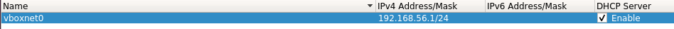

6.  Configure the Ushahidi VM’s network adapters

    a.  The VM has two network adapters - one for the NAT network and one for Host-Only

    b.  Do not change **Adapter 1,** it should be set to “NAT”. Do not change Adapter 1.

    c.  Click on the **Adapter 2** tab and select the name of the Host-Only Network that was setup in **Step 5b** above.

7.  Verify the Ushahidi VM’s network

    a.  Select the VM in the lefthand menu of VMs

    b.  Looking at the VM’s information displayed on the righthand side, look for the tab labeled “Network”. This tab should contain two network adapters, verify that the first adapter has the text **NAT** and that the second has **Host-only Adapter** at the end. The network tab should look like the following (note: your network interface may have a different name).

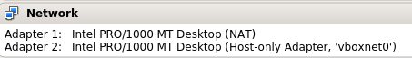

**Things you do each time you want to run the VM**

**Note:** The password to the default user account on the Ushahidi VM is
“**sigcse**”

8.  Start the virtual machine

    a.  Select the VM in the lefthand menu of VMs (it may be the only one if this is your first time using VirtualBox box) and select “Start”.

9.  Close the Welcome Menu that appears.

10.  A window will appear showing an Ubuntu Desktop. Under “Applications” &gt; ‘System Tools”, select “MATE Terminal”.

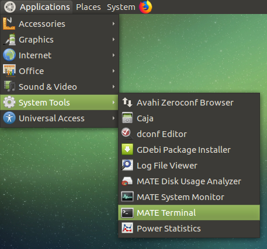

You may also use the shortcut “Alt + Ctrl + t” to open a terminal.

11.  Change directory with ‘cd’ into the directory **platform-client**

12.  Type “**npm run watch”** into the terminal

    a.  After a few seconds you should see green text that concludes with `webpack: Compiled successfully`

**Note:** When you are finished running the server, use CTRL + c to stop the server.

13.  (optional) If you wish to interact with the Ushahidi service from your host system, then you must do the following:

    a.  On the righthand side of the screen, there is an icon that displays two arrows going Up and Down. Right click the icon, and select “Connection Information”

    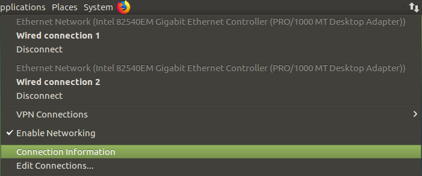

    b.  Select the tab “Wired Connection 2”, and find the IP address under the IPv4 tab.

    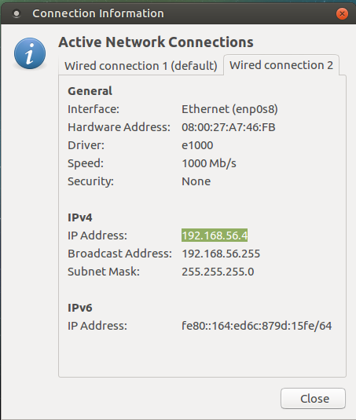

    c.  Copy down the IP address shown in the output, as this will be needed to access the VM from your Host system. In our case the address is **192.168.56.4**

14.  Depending on how you wish to interact with your VM, follow the applicable instructions below.

    a.  From within the VM itself, you can access the Ushahidi services by using the address of ‘**localhost**’.

    b.  From your host machine, you can access the Ushahidi services by using the address we found in **Step 13c**. In our case, the address is “**192.168.56.4**”

**Accessing the Ushahidi Website**

15.  Open a new Firefox browser in the VM by clicking the Firefox icon next to the menu on the upper lefthand of the screen next to “System”, or your preferred browser if you are using your host system.

16.  Navigate to the address we found in **Step 14**, followed by “**:3000**”. From within the VM, this address will be “**localhost:3000**”. From the host system, this address in our case will be “**192.168.56.4:3000**”.

17.  After opening the Ushahidi website loads, you should be greeted with a world map. It should look like the following.

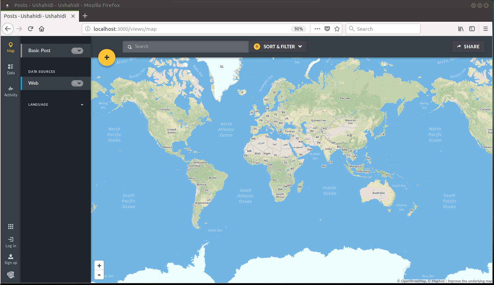

18.  Click the “Log in” button in the lower lefthand corner of the browser. To access the admin account enter the email "**admin@admin.com**” and the password “**adminadmin**”.

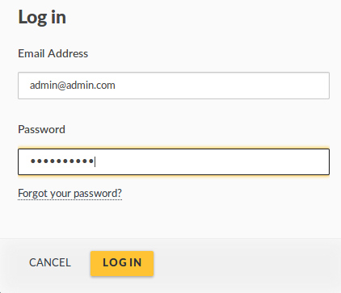

After you are successfully logged in, you will see a blue profile picture in the lower left hand corner.

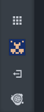

**Interacting with the Ushahidi API**

19.  You can access the Ushahidi API using “localhost” on the VM itself, or by using the address found in **Step 14**. In our case this is “192.168.56.4”.

20.  When you are finished using the Ushahidi VM, power it down using Power button in the upper righthand corner of the screen. After it is clicked, a dialog box will show a 60 second timer. You can wait for this to timeout, or click ‘Shut down’ to skip the timer.

**Interacting with the the Ushahidi Website**

21.  In order to become familiar with the website, lets submit a new Post to be added to the website.

    a.  Navigate to the Map page.

    b.  Click on the large yellow plus sign in the left hand corner of the map. You will then be shown the form used to create a new post.

    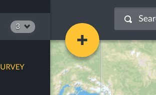

    c.  Enter the location of where the event happened by searching the location in the textbox above the map, clicking the location on the map, or specify the coordinates.

    d. Next enter the title and description of your post.

    e.  If you want to select a category, select the checkbox that pertains to your post or create a new category.

    f.  Click the yellow ‘Submit’ button in the top righthand corner when you are satisfied with your post.

    g.  After you submit your post it will be considered ‘Under review’, and will only be displayed after it is approved by an administrator.

22.  Approving Posts that are under review.

    a.  Login with the Administrator account as detailed in **Step 18**.

    b.  After you are logged in with an administratora account, click the ‘Data’ icon in the menu on the left.

    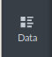

    c.  All of the posts on the website will be shown in the column on the left side of the window. Posts that are awaiting approval will have the ‘Under review’ tag.

    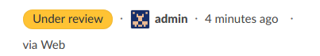

    Click on any post to view the details about it.

    d.  If you wish to edit a post before its publication, click the three dots in the upper righthand corner of the post, and select ‘Edit’. Here you may make modifications to the post if you wish.

    e.  When you are ready to publish the post, click the three dots again, and select ‘Publish’.

    f.  The post will now have the ‘Published’ tag, and will now be displayed for everyone viewing the website.

